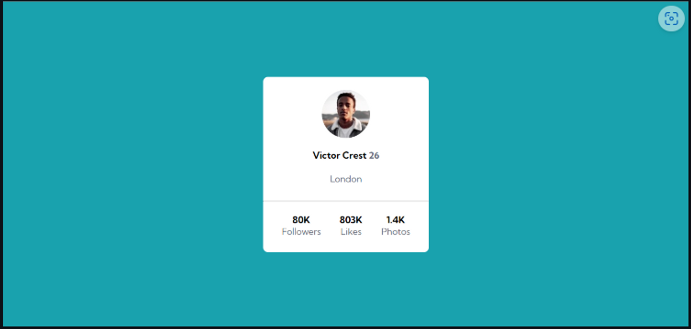
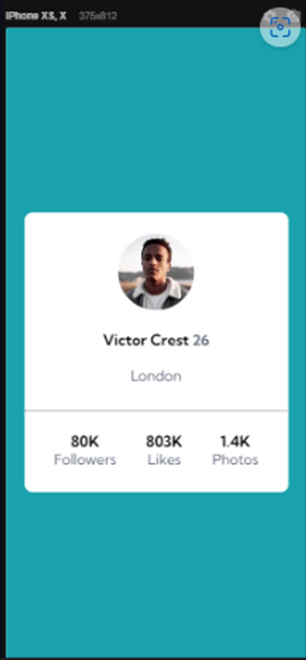

<h1 align="center"> Exercício Cartão de Perfil </h1>

### Descrição do projeto: 
- O desafio é criar um cartão que contenha as informações de perfil. Para ser aprimorado as habilidades de posicionamento de elementos usando flexbox. 

### Design do projeto:
- Desktop:

- Mobile

#### Dificuldades:
- Minha maior dificuldade com esse projeto foi em quais tags colocar o display flex para que os elementos ficassem centralizados.

#### Status do projeto: Finalizado

#### Tecnologias utilizadas:
- HTML5
- CSS3
